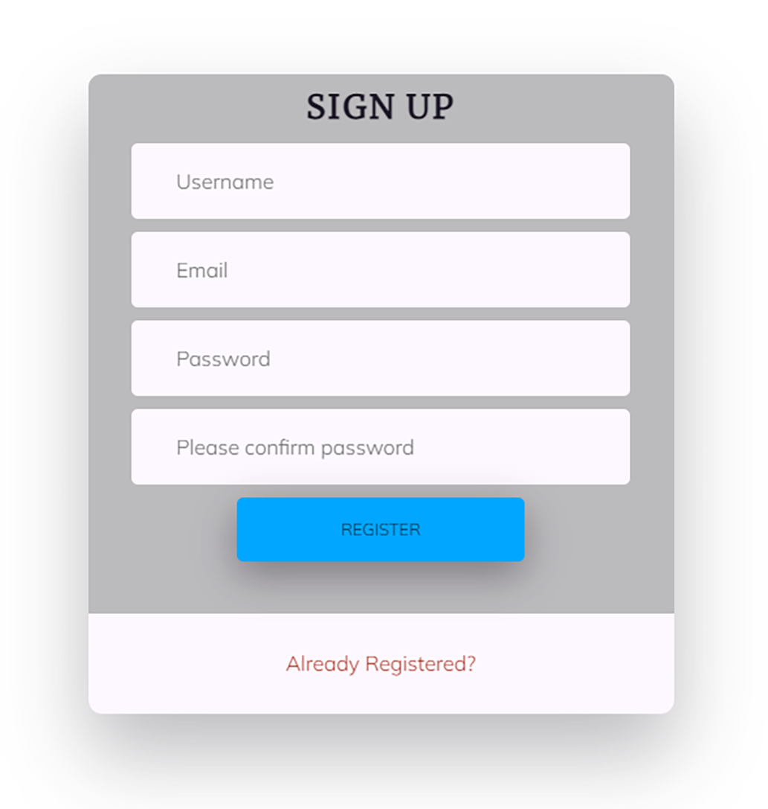
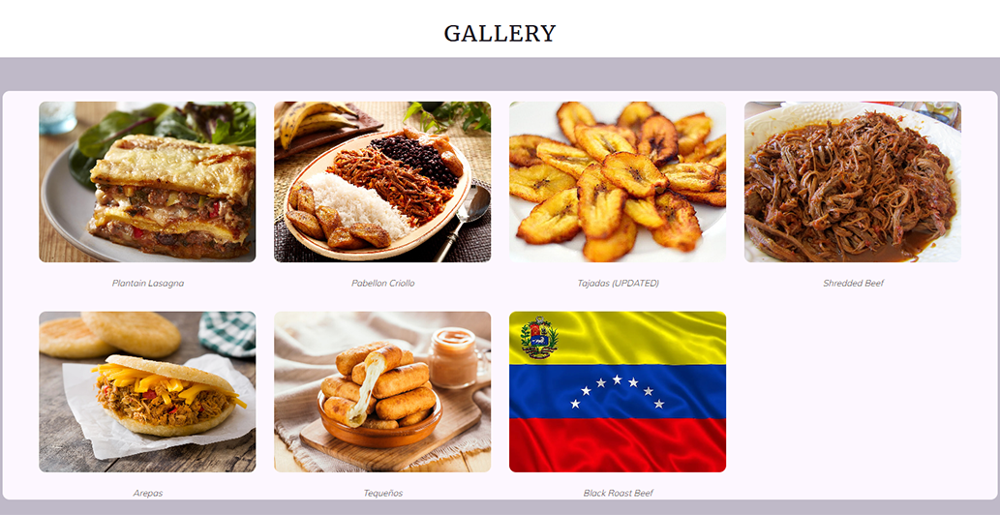
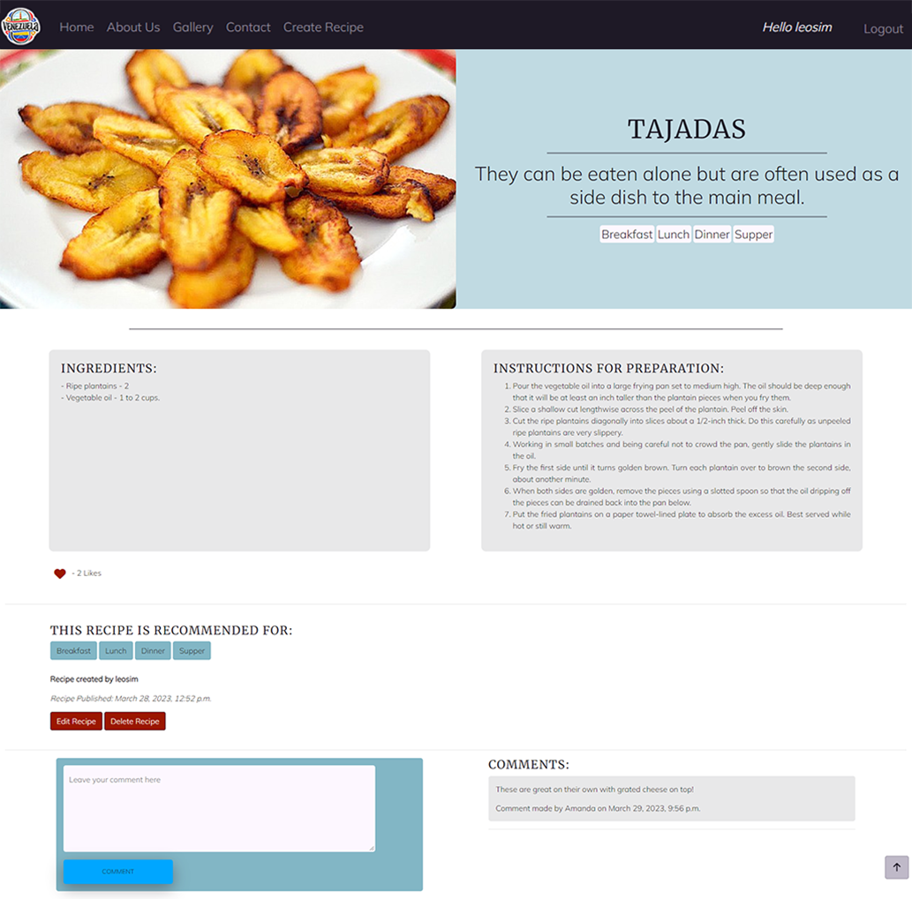
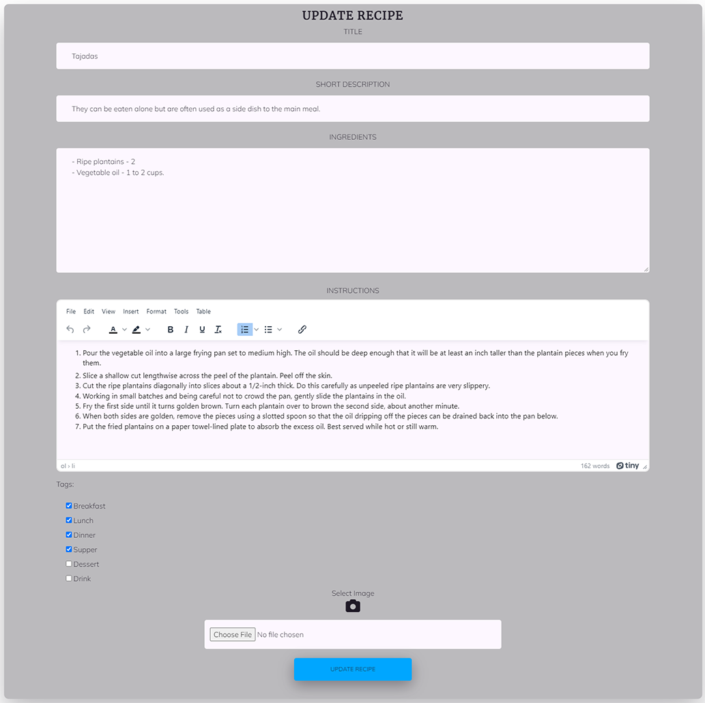
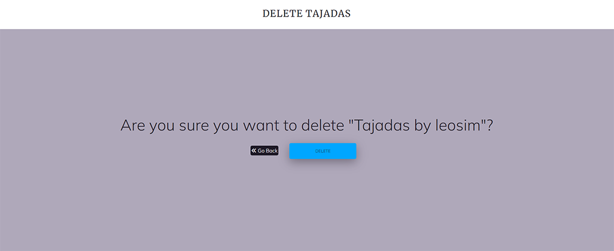
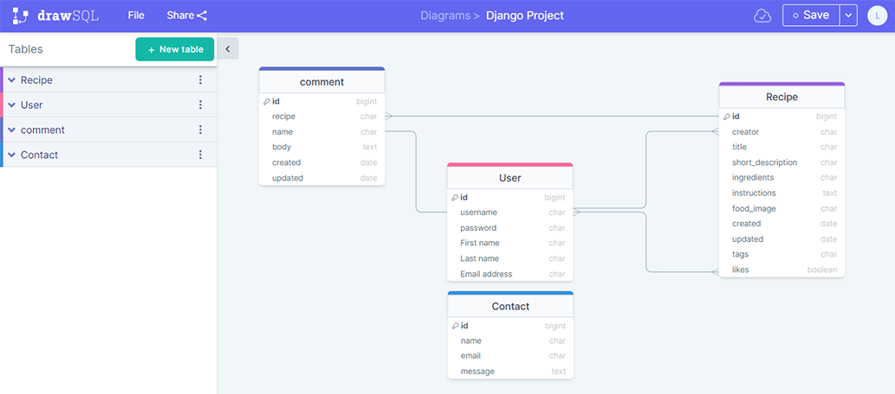
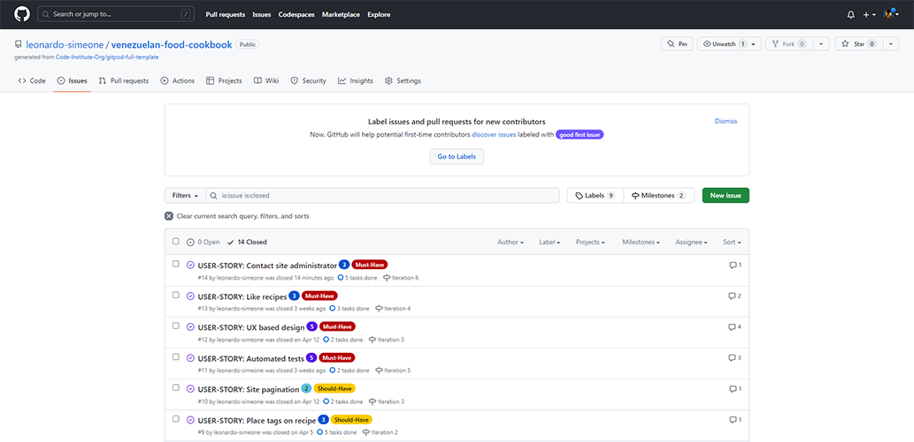

# VENEZUELAN FOOD COOKBOOK

Venezuelan Food Cookbook, is a website designed to provide a space wherein users can create their own venezuelan food recipes, upload them and share their culinary skills with everybody. Users can also avail of the recipes already uploaded on the site. They can learn and try new dishes from a tropical country such as Venezuela, wherein, food is one of its main features.

The point of this initiative is to broaden the knowledge about Venezuelan dishes. Nowadays, users can see these recipes being cooked anywhere in the world, thanks to the large exodus of Venezuelan people across the globe, the necessary ingredients can be found in several stores, some particular ones can be found in foreign-goods shops. Users can register to the site and once logged in they have access to all the site's features. Not only can they upload, update and delete their own recipes but they can also participate in conversations related to a particular recipe by writing comments and they can like or unlike recipes.

This site seeks to provide a service required by users world-wide looking to expand and share culinary knowledge.


## UX

### Colour Scheme

* To select the colors, I used the [ColorSpace](https://mycolor.space/) website which provides the option to input any color you want and then it will provide a selection of matching/compatible colors that relate well to that "base" color you selected in the first place.
* Once I had my base color selected which is [#0000FF](https://mycolor.space/?hex=%230000FF&sub=1), I used ColorSpace and it gave me a wide variety of compatible colors to work with from which I chose several of them and referenced them accordingly in the css style sheet.   


### Typography

* Since the google fonts page feature for fonts pairing suggestions was discontinued, I used an alternative tool available to select the fonts for the site.
* I browsed [heyreliable](https://heyreliable.com/ultimate-google-font-pairings/) google fonts pairings available in their collection and selected number 13 based on the look and mood wanted for the site.
    


* These fonts are clear to read, they have a friendly yet professional style which is compatible with a culinary website.

- [Merriweather](https://fonts.google.com/specimen/Merriweather) was used for the primary headers and titles.

- [Mulish](https://fonts.google.com/specimen/Mulish) was used for all other secondary text.

- [Font Awesome](https://fontawesome.com) icons were used throughout the site, such as the social media icons in the footer.

## User Stories

### Site Users

- As a site user, I would like to view a list of recipes, so that I can select one to read, [Link here](https://github.com/leonardo-simeone/venezuelan-food-cookbook/issues/3).
- As a site user, I would like to click on a recipe, so that I can read/see the full content, [Link here](https://github.com/leonardo-simeone/venezuelan-food-cookbook/issues/4).
- As a site user, I would like to view comments on an individual recipe, so that I can read the conversation, [Link here](https://github.com/leonardo-simeone/venezuelan-food-cookbook/issues/5).
- As a site user, I would like to register an account, so that I can create my own recipes, [Link here](https://github.com/leonardo-simeone/venezuelan-food-cookbook/issues/6).
- As a registered site user, I would like to make comments on a recipe, so that I can start and/or be involved in a conversation, [Link here](https://github.com/leonardo-simeone/venezuelan-food-cookbook/issues/7).
- As a registered site user, I would like to update and delete recipes, so that I can manage my recipes content, [Link here](https://github.com/leonardo-simeone/venezuelan-food-cookbook/issues/8).
- As a registered site user, I would like to place tags on my created recipes, so that I can indicate the meal type, [Link here](https://github.com/leonardo-simeone/venezuelan-food-cookbook/issues/9).
- As a site user, I would like to view a paginated list of recipes, so that I can easily select which recipe to view, [Link here](https://github.com/leonardo-simeone/venezuelan-food-cookbook/issues/10).
- As a site user, I would like to avail of a website with a UX based design, so that I can navigate and interact with it easily and intuitively, [Link here](https://github.com/leonardo-simeone/venezuelan-food-cookbook/issues/12).
- As a registered site user, I would like to like recipes, so that I can show I liked a particular recipe, [Link here](https://github.com/leonardo-simeone/venezuelan-food-cookbook/issues/13).

### Site Admin

- As a site administrator, I should be able to  create, read, update and delete my own recipes and the ones created by registered users, so that I can moderate the content of the site, [Link here](https://github.com/leonardo-simeone/venezuelan-food-cookbook/issues/1).
- As a site administrator, I should be able to create, read, update and delete my comments and the ones created by registered users, so that I can moderate the conversations, [Link here](https://github.com/leonardo-simeone/venezuelan-food-cookbook/issues/2).
- As a site administrator, I should be able to view comments on an individual recipe, so that I can read the conversation, [Link here](https://github.com/leonardo-simeone/venezuelan-food-cookbook/issues/5)

### Product Owner

- As a product owner, I should be able to run automated tests, so that I can make sure everything is working as it should, [Link here](https://github.com/leonardo-simeone/venezuelan-food-cookbook/issues/11)

## Wireframes

To wireframe the website I used [Whimsical](https://whimsical.com/wireframes).


## Features

### Existing Features

- **Navagation Bar**

    - The navigation bar is located at the top of the screen and it's centered both vertically and horizontally. It has the site logo on the left side as well as the navigation links for Home, About Us, Gallery and Create Recipe. On the right side it has the links for Register, Login and a call to action message should the user not be registered or logged in. It also has a 'Hello User' message and a Logout link on this side should the user be logged in.
    - The navigation bar is fully responsive thanks to the use of Bootstrap, also the layout changes to expandable and fully vertical once small screens are used.
    - All links in the navigation menu have visual cues regarding where the user currently is on the site, as well as which links are they about to click on, making it easier to navigate.
    - The navigation menu is identical across all the pages on the site which provides quick navigation learning.


- **Home/Index**

    - The home page welcomes the user (new or returning) to the site, it subtly and intuitively shows the user what the site is about via carousel images/text and what it offers, which is a site to learn, try and upload dishes from a tropical country such as Venezuela. It displays the existing recipes in groups of three, the recipes show the recipe image, its title, short description and date of creation. At the end of the recipes group, it has a pagination feature allowing the user to navigate to other recipes and be in full control of the navigation by being able to navigate to the next page/group or simply skip to a specific page/group number.


- **Register**

    - The register page allows the user as its name indicates to register to the site. The user needs to supply a username, email, password and then confirm said password, once the register button is clicked on, the user will be registered and automatically logged in. Should the user have already registered, the option to login is provided at the end of the form.
    - The register form was designed to provide an easy to follow pattern and using colors that are compatible with the site as a whole, seeking to provide optimal UX.



- **Login**

    - The login page allows a registered user to login with their username and password.
    - Once logged in the user can avail of all the features that an authenticated user is allowed, such as comment on recipes, create new recipes, update/delete their recipes and like or unlike recipes.
    - Should the user not be registered yet, the option to do so is provided at the end of the form.
    - As all the forms in the site, the login form was design to provide optimal UX. 


- **About Us**

    - The about us page is an informational page where the user can find more detailed information regarding the website, its purpose and what is needed to participate.
    - Within the informative text there are two calls to action indicating the user to register and login.
    - This page contains the same informational carousel as the home page.


- **Gallery**

    - The gallery page contains the total of the existing recipes displayed in a orderly manner, in this page the user can find all the recipes pictures with their corresponding titles, this way should the user want to find a specific recipe by its image/title, they just have to click on them since all the objects (recipes) are linked to their specific page.
    - All the objects have visual cues when hovered-over/clicked-on to indicate the user the items are clickable.



- **Recipe Unit**

    - The recipe unit page contains the detailed information about a specific recipe, it displays at the top, the recipe image along with its title, short description and tags should there be any, right after in two separate colums (or rows in small screens), it displays the ingredients and instructions for the recipe.
    - Next to a heart icon, it shows the number of likes this recipe has. The icon is clickable and an authenticated user can use it to like or unlike the recipe.
    - Should there be any tags for the recipe they will be displayed after the likes icon along with the recipe creator and the date of publication.
    - Lastly the comment section for authenticated users will display two separate colums (or rows in small screens), on one column there will be a form where the user can write and submit their comment and on the other, should there exist any comments, they will be shown.
    - If the user is not authenticated (not logged in) then the likes amount will be shown but the user won't be able to like or unlike the recipe, and the comments will be shown but the user won't be able to make comments.



- **Create Recipe**

    - The create recipe page contains the form necessary to create a new recipe, only authenticated users can access this page.
    - It requieres the user to provide a recipe title, a recipe short description, the recipe ingredients and its instructions. All of these four fields are mandatory, both by the database and the form thanks to their 'null' and 'blank' attributes set to 'False' in the model. Should the user try to submit a recipe without one of these, an error will be shown to the user indicating so.
    - The intructions field has a WYSIWYG text editor (TinyMCE) which provides the user with the tools to write the instructions in a more custom way.
    - The tags field come after the instructions field and tags are optional, the user could create a recipe without any tags, some tags or all of them.
    - The last field is the image field, where the user could if they wanted to, upload an image for their recipe. Since the image is optional, should the user decide not to use one, then a default image will be assigned by the site.


- **Edit/Update Recipe**

    - The update recipe page contains the form necessary to edit/update a recipe previously created, only users that are authenticated and are the recipe owner can access this page.
    - The fields in this form will be prefilled with the existing data for the recipe, allowing the user to edit from the point where they left off the recipe.
    - The fields will be the exact same ones as the ones in the create recipe form.
    - The intructions field will also have a WYSIWYG text editor (TinyMCE).



- **Delete Recipe**

    - The delete recipe page contains the form/button necessary to delete a recipe previously created, only users that are authenticated and are the recipe owner can access this page.
    - The page shows the user a warning paragraph asking 'are you sure you want to delete recipe' (recipe includes title and creator), which prompts the user that they are about to delete their recipe.
    - After the warning question there are two buttons, one to offer the user the option to go back to the recipe and one to delete the recipe.



- **Footer**

    - The footer the same as the navbar, is identical across the site.
    - The footer contains several links. Links to social media such as Facebook, Instagram, YouTube and Twitter which open in a different tab. It also contains links to Privacy Policy and Terms & Conditions which are both modals.
    - At the end of the footer there is the name of the site and the programmer's credits.


- **Messages**

    - Every time the user completes an action whether it be register, login, logout, comment on a recipe, like a recipe, create a recipe, update a recipe or delete a recipe, a relevant message will be displayed at the top of the screen to inform the user about the action being completed successfully.
    - Also should the user perform an unauthorized action such as trying to force their way to a page that requires permission, or introduces the wrong username or password during login, a message will also show.
    - Messages will only stay on screen for ten seconds and will dissapear automatically after that time, also an 'X' will be on the top right corner of the message box in case the user wants to discard it before the ten seconds have passed.


- **Modals**

    - Privacy Policy and Terms & Conditions were included in modals.
    - A standard Bootstrap 4 modal was used for Privacy Policy.
    - A Bootstrap 4 scrolling long content modal was used for Terms & Conditions given its larger content.


- **Back to Top Button**

    - A back to top button was included across the site to improve UX. The user will be able to go back to the top of the page with the click of a button instead of manually doing so.
    - The back to top button will show up only when the user starts to scroll down, when the user is located at the very top of the page the button will not be visible.


- **404/500 Custom Pages**

    - The 404 and 500 custom error pages show said errors in a user friendly way.
    - The custom pages allow the user to avail of the navbar and footer present in all the other pages, making it easier for the user to go anywhere they want in the site after getting the error.


### Future Features

- Confirmation email
    - Create functionality to request user email confirmation to register, via an automated email.
- Password reset
    - Offer the user the option to reset their password in case they forget it.
- Edit/Update and delete own comments.
    - Offer the user the option to edit/update and delete their own comments.

## Tools & Technologies Used

- [HTML](https://en.wikipedia.org/wiki/HTML) used for the main site content.
- [CSS](https://en.wikipedia.org/wiki/CSS) used for the main site design and layout.
- [CSS Flexbox](https://www.w3schools.com/css/css3_flexbox.asp) used for an enhanced responsive layout.
- [CSS Grid](https://www.w3schools.com/css/css_grid.asp) used for an enhanced responsive layout.
- [JavaScript](https://www.javascript.com) used for user interaction on the site.
- [Python](https://www.python.org) used as the back-end programming language.
- [Git](https://git-scm.com) used for version control. (`git add`, `git commit`, `git push`)
- [GitHub](https://github.com) used for secure online code storage.
- [Gitpod](https://gitpod.io) used as a cloud-based IDE for development.
- [Bootstrap](https://getbootstrap.com) used as the front-end CSS framework for modern responsiveness and pre-built components.
- [Django](https://www.djangoproject.com) used as the Python framework for the site.
- [PostgreSQL](https://www.postgresql.org) used as the relational database management.
- [ElephantSQL](https://www.elephantsql.com) used as the Postgres database.
- [Heroku](https://www.heroku.com) used for hosting the deployed back-end site.
- [Cloudinary](https://cloudinary.com) used for online static file storage.
- [Gunicorn](https://gunicorn.org/) used as a server provider for the site.
- [Psycopg2](https://pypi.org/project/psycopg2/) used as a postgres database adapter.
- [TinyMCE](https://www.tiny.cloud/) used as clud based WYSIWYG text editor.
- [Adobe Photoshop](https://www.adobe.com/ie/products/photoshop.html) used to resize/edit images as well as framing several images together into one.

## Database Design

Entity Relationship Diagrams (ERD) help to visualize database architecture before creating models.
Understanding the relationships between different tables can save time later in the project.

```python
class Recipe(models.Model):

    """
    The Recipe class inherits from django.db models, it contains a tuple
    which defines the recipe tags used in the tags field. It also has all
    the fields used for the model. This model is used to hold the information
    pertaining to recipe objects attributes. There are two particular
    relationships in the model, the creator field has a One to Many
    relationship with User since one user can create many recipes and
    the likes field has a M2M relationship with User since many users
    can like many recipes. This model has a meta class to determine the
    descending order of the recipe objects and two helper methods,
    one to count the number of likes and one to represent the objects
    with a custom string.
    """

    RECIPE_TAGS = (('Breakfast', 'Breakfast'), ('Lunch', 'Lunch'), ('Dinner', 'Dinner'), ('Supper', 'Supper'), ('Dessert', 'Dessert'), ('Drink', 'Drink'),)

    creator = models.ForeignKey(User, on_delete=models.CASCADE, default=1, related_name='recipe_creator')
    title = models.CharField(max_length=25, unique=True, null=False, blank=False)
    short_description = models.CharField(max_length=100, null=False, blank=False)
    ingredients = models.TextField(null=False, blank=False)
    instructions = HTMLField(null=False, blank=False)
    food_image = CloudinaryField('image', default='default-image')
    created = models.DateTimeField(auto_now_add=True)
    updated = models.DateTimeField(auto_now=True)
    tags = MultiSelectField(max_length=120, choices=RECIPE_TAGS, null=True, blank=True)
    likes = models.ManyToManyField(User, related_name='recipe_likes', blank=True)

    class Meta:
        ordering = ['-created']

    def total_likes(self):
        return self.likes.count()

    def __str__(self):
        return self.title + ' by ' + self.creator.username


class Comment(models.Model):

    """
    The Comment class inherits from django.db models, it contains
    the information pertaining to comment objects attributes.
    There is one particular relationship in the model, the recipe field
    has a One to Many relationship with Recipe since one recipe
    can have many comments. This model has a meta class to determine
    the ascending order of the comment objects and one helper method
    to represent the objects with a custom string.
    """

    recipe = models.ForeignKey(Recipe, on_delete=models.CASCADE, null=True, blank=True, related_name='comments')
    name = models.CharField(max_length=200)
    body = models.TextField()
    created = models.DateTimeField(auto_now_add=True)
    updated = models.DateTimeField(auto_now=True)

    class Meta:
        ordering = ['created']

    def __str__(self):
        return 'Comment made by ' + self.name + ' on ' + self.recipe.title
```



- Table: **Recipe**

    | **PK** | **id** (unique) | Type | Notes |
    | --- | --- | --- | --- |
    | **FK** | creator | ForeignKey | FK to **User** model |
    | | title | CharField | |
    | | short_description | CharField | |
    | | ingredients | TextField | |
    | | instructions | HTMLfield | |
    | | food_image | CloudinaryField | |
    | | created | DateTimeField | |
    | | updated | DateTimeField | |
    | | tags | MultiSelectField | |
    | | likes | ManyToManyField | M2M to **User** model |

- Table: **Comment**

    | **PK** | **id** (unique) | Type | Notes |
    | --- | --- | --- | --- |
    | **FK** | recipe | ForeignKey | FK to **Recipe** model |
    | | name | CharField | Obtained from username |
    | | body | TextField | |
    | | created | DateTimeField | |
    | | updated | DateTimeField | |

### Graphviz ERD

I used `graphviz` and `django-extensions` to auto-generate the full Django ERD.

Steps taken were:

1. `sudo apt update`
2. `sudo apt-get install python3-dev graphviz libgraphviz-dev pkg-config`
3. Type `Y` to confirm.
4. `pip3 install django-extensions pygraphviz`

Then in my [settings.py](venezuelan_food/settings.py) file, within the `INSTALLED_APPS` variable, I included `django_extensions`:

```python
INSTALLED_APPS = [
    ...
    'django_extensions',
    ...
]
```

Finally, I ran the `graph_models` command in the CLI: `python3 manage.py graph_models -a -o erd-django.png`

This created my [erd-django.png](documentation/erd-django.png) entity relationship diagram below.


\* source: [medium.com](https://medium.com/@yathomasi1/1-using-django-extensions-to-visualize-the-database-diagram-in-django-application-c5fa7e710e16)

**Note**: I do not plan to keep `django-extensions` or `pygraphviz` on this project, so I've removed from the INSTALLED_APPS and uninstalled them using: `pip3 uninstall django-extensions pygraphviz -y`.

## Agile Development Process

### GitHub Projects

[GitHub Projects](https://github.com/leonardo-simeone/venezuelan-food-cookbook/projects?query=is%3Aclosed) served as an Agile tool for this project.
It isn't a specialized tool, but with the right tags and project creation/issue assignments, it can be made to work.

Through it, user stories, issues, and milestone tasks were planned, then tracked on a weekly basis using the basic Kanban board.


### GitHub Issues

[GitHub Issues](https://github.com/leonardo-simeone/venezuelan-food-cookbook/issues) served as an another Agile tool.
There, I used my own **User Story Template** to manage user stories.

It also helped with milestone iterations on a weekly basis.

- [Open Issues](https://github.com/leonardo-simeone/venezuelan-food-cookbook/issues), no open issues remaining.


- [Closed Issues](https://github.com/leonardo-simeone/venezuelan-food-cookbook/issues?q=is%3Aissue+is%3Aclosed)



### MoSCoW Prioritization

I was able to apply the MoSCow prioritization and labels to my user stories within the Issues tab.

- **Must Have**: guaranteed to be delivered (*max 60% of stories*)
- **Should Have**: adds significant value, but not vital (*the rest ~20% of stories*)
- **Could Have**: has small impact if left out (*20% of stories*)
- **Won't Have**: not a priority for this iteration

## Testing

For all testing, please refer to the [TESTING.md](TESTING.md) file.

## Deployment

The live deployed application can be found deployed on [Heroku](https://venezuelan-cookbook.herokuapp.com).

### ElephantSQL Database

This project uses [ElephantSQL](https://www.elephantsql.com) for the PostgreSQL Database.

To obtain your own Postgres Database, sign-up with your GitHub account, then follow these steps:
- Click **Create New Instance** to start a new database.
- Provide a name (this is commonly the name of the project: venezuelan-food-cookbook).
- Select the **Tiny Turtle (Free)** plan.
- You can leave the **Tags** blank.
- Select the **Region** and **Data Center** closest to you.
- Once created, click on the new database name, where you can view the database URL and Password.

### Cloudinary API

This project uses the [Cloudinary API](https://cloudinary.com) to store media assets online, due to the fact that Heroku doesn't persist this type of data.

To obtain your own Cloudinary API key, create an account and log in.
- For *Primary interest*, you can choose *Programmable Media for image and video API*.
- Optional: *edit your assigned cloud name to something more memorable*.
- On your Cloudinary Dashboard, you can copy your **API Environment Variable**.
- Be sure to remove the `CLOUDINARY_URL=` as part of the API **value**; this is the **key**.

### Heroku Deployment

This project uses [Heroku](https://www.heroku.com), a platform as a service (PaaS) that enables developers to build, run, and operate applications entirely in the cloud.

Deployment steps are as follows, after account setup:

- Select **New** in the top-right corner of your Heroku Dashboard, and select **Create new app** from the dropdown menu.
- Your app name must be unique, and then choose a region closest to you (EU or USA), and finally, select **Create App**.
- From the new app **Settings**, click **Reveal Config Vars**, and set your environment variables.

| Key | Value |
| --- | --- |
| `CLOUDINARY_URL` | user's own value |
| `DATABASE_URL` | dj_database_url.parse(os.environ.get("DATABASE_URL")) |
| `DISABLE_COLLECTSTATIC` | 1 (*this is temporary, and can be removed for the final deployment*) |
| `SECRET_KEY` | os.environ.get('SECRET_KEY') |

Heroku needs two additional files in order to deploy properly.
- requirements.txt
- Procfile

You can install this project's **requirements** (where applicable) using:
- `pip3 install -r requirements.txt`

If you have your own packages that have been installed, then the requirements file needs updated using:
- `pip3 freeze --local > requirements.txt`

The **Procfile** can be created with the following command:
- `echo web: gunicorn app_name.wsgi > Procfile`
- *replace **app_name** with the name of your primary Django app name; the folder where settings.py is located*

For Heroku deployment, follow these steps to connect your own GitHub repository to the newly created app:

Either:
- Select **Automatic Deployment** from the Heroku app.

Or:
- In the Terminal/CLI, connect to Heroku using this command: `heroku login -i`
- Set the remote for Heroku: `heroku git:remote -a app_name` (replace *app_name* with your app name)
- After performing the standard Git `add`, `commit`, and `push` to GitHub, you can now type:
	- `git push heroku main`

The project should now be connected and deployed to Heroku!

### Local Deployment

This project can be cloned or forked in order to make a local copy on your own system.

For either method, you will need to install any applicable packages found within the *requirements.txt* file.
- `pip3 install -r requirements.txt`.

You will need to create a new file called `env.py` at the root-level,
and include the same environment variables listed above from the Heroku deployment steps.

Sample `env.py` file:

```python
import os

os.environ.setdefault("CLOUDINARY_URL", "user's own value")
os.environ.setdefault("DATABASE_URL", "user's own value")
os.environ.setdefault("SECRET_KEY", "user's own value")

# local environment only (do not include these in production/deployment!)
os.environ.setdefault("DEBUG", "True")
```

Once the project is cloned or forked, in order to run it locally, you'll need to follow these steps:
- Start the Django app: `python3 manage.py runserver`
- Stop the app once it's loaded: `CTRL+C` or `⌘+C` (Mac)
- Make any necessary migrations: `python3 manage.py makemigrations`
- Migrate the data to the database: `python3 manage.py migrate`
- Create a superuser: `python3 manage.py createsuperuser`
- Load fixtures (if applicable): `python3 manage.py loaddata file-name.json` (repeat for each file)
- Everything should be ready now, so run the Django app again: `python3 manage.py runserver`

#### Cloning

You can clone the repository by following these steps:

1. Go to the [GitHub repository](https://github.com/leonardo-simeone/venezuelan-food-cookbook) 
2. Locate the Code button above the list of files and click it 
3. Select if you prefer to clone using HTTPS, SSH, or GitHub CLI and click the copy button to copy the URL to your clipboard
4. Open Git Bash or Terminal
5. Change the current working directory to the one where you want the cloned directory
6. In your IDE Terminal, type the following command to clone my repository:
	- `git clone https://github.com/leonardo-simeone/venezuelan-food-cookbook.git`
7. Press Enter to create your local clone.

Alternatively, if using Gitpod, you can click below to create your own workspace using this repository.

[](https://gitpod.io/#https://github.com/leonardo-simeone/venezuelan-food-cookbook)

Please note that in order to directly open the project in Gitpod, you need to have the browser extension installed.
A tutorial on how to do that can be found [here](https://www.gitpod.io/docs/configure/user-settings/browser-extension).

#### Forking

By forking the GitHub Repository, we make a copy of the original repository on our GitHub account to view and/or make changes without affecting the original owner's repository.
You can fork this repository by using the following steps:

1. Log in to GitHub and locate the [GitHub Repository](https://github.com/leonardo-simeone/venezuelan-food-cookbook)
2. At the top of the Repository (not top of page) just above the "Settings" Button on the menu, locate the "Fork" Button.
3. Once clicked, you should now have a copy of the original repository in your own GitHub account!

### Local VS Deployment

The only difference I found between local version and heroku deployment, was the static files. Every time that static files were changed, I had to add DISABLE_COLLECTSTATIC = 1 as a configuration variable in heroku and then deploy, once the deployment was successfull, I had to remove DISABLE_COLLECTSTATIC = 1 from the configuration variables in heroku and deploy again, only then all static files uploaded successfully and the site worked.

## Credits

### Content

| Source | Location | Notes |
| --- | --- | --- |
| [Markdown Builder](https://traveltimn.github.io/markdown-builder) | README and TESTING | Tool to help generate the Markdown files |
| [Python.plainenglish.io](https://python.plainenglish.io/how-to-implement-pagination-in-django-with-function-based-views-8f6462554930) | Home Page | 'How to implement pagination in django with function based views' |
| [Fresh Design Web](https://codepen.io/danzawadzki/pen/EgqKRr) | All Forms | Responsive forms design, number seven in [Fresh Design Web](https://freshdesignweb.com/css-login-form-templates/), used and adapted to my needs |
| [Fontawesome](https://fontawesome.com/search?o=r&m=free) | Social Media Links & Forms | Icons |
| [Alvarotrigo.com](https://codepen.io/anon/embed/ZExxeRz?height=450&theme-id=dark&default-tab=only-result&user=&slug-hash=ZExxeRz&pen-title=&name=cp_embed_5#result-box) | entire site | Responsive footer design, number five in [Alvarotrigo.com](https://alvarotrigo.com/blog/website-footers/), used and adapted to my needs |
| [Mdbootstrap.com](https://mdbootstrap.com/snippets/standard/mdbootstrap/2964350#js-tab-view) | entire site | Back to top button, used and adapted to my needs |
| [Termsfeed.com](https://www.termsfeed.com/public/uploads/2018/09/500px-terms-use-conduct-prohibited-activities-clause-excerpt.jpg) | T&C modal | Used and adapted to my needs |
| [Termly.io](https://termly.io/resources/templates/privacy-policy-template/) | Privacy Policy modal | Used the data listed in 'Example of a Standard Privacy Policy for a Website' to create Privacy Policy |
| [Freefrontend.com](https://codepen.io/luclemo/pen/VGrOjv) | Gallery | Responsive gallery design, number twenty nine 'HORIZONTAL SLIDER TO GALLERY GRID' in [Freefrontend.com](https://freefrontend.com/css-gallery/), used and adapted to my needs |
| [Stackoverflow.com](https://stackoverflow.com/questions/3222549/how-to-automatically-login-a-user-after-registration-in-django/3222558#3222558) | Register View | 'How to automatically login a user after registration in django', used and adapted to my needs |
| [Tiny.cloud](https://www.tiny.cloud/docs/quick-start/#) | instructions field in forms | 'How to add a TinyMCE editor to a web page using the Tiny Cloud', used and adapted to my needs |
| [Stackoverflow.com](https://stackoverflow.com/questions/39639264/django-highlight-current-page-in-navbar) | entire site | 'How to dynamically highlight current page in navbar', used and adapted to my needs |
| [YouTube](https://www.youtube.com/playlist?list=PLCC34OHNcOtr025c1kHSPrnP18YPB-NFi) | entire site | 'Tutorial on how to create a blog site with Python and Django', used several parts of the tutorial and adapted to my needs |

### Media

| Source | Location | Type | Notes |
| --- | --- | --- | --- |
| [Etsystatic](https://i.etsystatic.com/23821301/r/il/1137e7/3589659680/il_fullxfull.3589659680_lcxd.jpg) | entire site | image | favicon on all pages |
| [Vectorstock](https://cdn5.vectorstock.com/i/1000x1000/16/79/logo-for-venezuela-vector-21441679.jpg) | entire site | image | logo image on all pages |
| [Worldatlas](https://www.worldatlas.com/r/w768/upload/87/f8/d9/shutterstock-177064736-min.jpg) | home/recipe/gallery pages | image | default image for recipe |
| [Elviajerofeliz](https://elviajerofeliz.com/wp-content/uploads/2020/09/comida-tipica-de-venezuela.jpg) | home/about-us pages | image | venezuelan assorted food for carousel |
| [Blogs.es](https://i.blogs.es/ae7bdc/1366_2000-3-/1366_2000.jpg) | home/about-us pages | image | venezuelan assorted food for carousel |
| [Eluniversal](https://mmedia.eluniversal.com/17928/gastrooo-16768.jpg) | home/about-us pages | image | venezuelan assorted food for carousel |
| [Media.traveler.es](https://media.traveler.es/photos/6137624bf00fb1ba8d866aec/master/pass/195224.jpg) | home/recipe/gallery pages | image | image for the arepas recipe |
| [Gastroactitud](https://www.gastroactitud.com/wp-content/uploads/2017/11/pabellon-criollo.jpg) | home/recipe/gallery pages | image | image for the pabellon-criollo recipe |
| [Noticias24carabobo](https://noticias24carabobo.com/wp-content/uploads/2021/03/pasticho.jpg) | home/recipe/gallery pages | image | image for the plantain lasagna recipe |
| [Paulinacocina](https://www.paulinacocina.net/wp-content/uploads/2021/10/tequen%CC%83os-con-queso-800x534.jpg) | home/recipe/gallery pages | image | image for the tequeños recipe |
| [Recetasvenezolanas](https://www.recetasvenezolanas.org/wp-content/uploads/2019/04/carne-mechada.jpg) | home/recipe/gallery pages | image | image for the shredded beef recipe |
| [Cloudfront](https://d1kxxrc2vqy8oa.cloudfront.net/wp-content/uploads/2019/05/27113051/RFB-1505-4-tajadasfritas.jpg) | home/recipe/gallery pages | image | image for the tajadas recipe |
| [Notesfromamessykitchen](https://www.notesfromamessykitchen.com/wp-content/uploads/2013/04/img_19471.jpg) | 404/500 pages | image | image for the custom 404/500 error pages |

### Acknowledgements

- I would like to thank my Code Institute mentor, [Tim Nelson](https://github.com/TravelTimN) for his fantastic support throughout the development of this project, for going the extra mile to be as approachable and understanding as humanly possible.
- I would like to thank the [Code Institute](https://codeinstitute.net) tutor team for their assistance with troubleshooting and debugging some project issues.
- I would like to thank the [Code Institute Slack community](https://code-institute-room.slack.com) for the moral support; it kept me going during periods of self doubt and imposter syndrome.
- I would like to thank my wife Amanda, for believing in me, and supporting me unconditionally.
