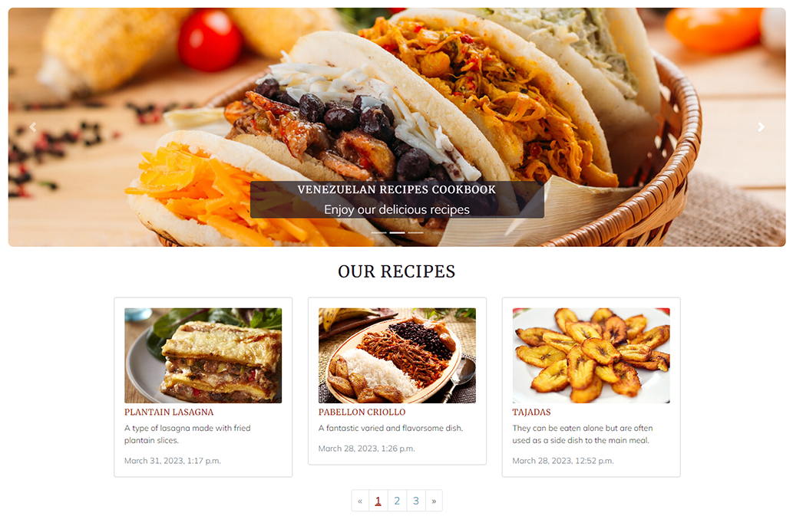

# VENEZUELAN FOOD COOKBOOK

Venezuelan Food Cookbook, is a website designed to provide a space wherein users can create their own venezuelan food recipes, upload them and share their culinary skills with everybody. Users can also avail of the recipes already uploaded on the site. They can learn and try new dishes from a tropical country such as Venezuela, wherein, food is one of its main features. The point of this initiative is to broaden the knowledge about Venezuelan dishes. Nowadays, users can see these recipes being cooked anywhere in the world, thanks to the large exodus of Venezuelan people across the globe, the necessary ingredients can be found in several stores, some particular ones can be found in foreign-goods shops. Users can register to the site and once logged in they have access to all the site's features. Not only can they upload, update and delete their own recipes but they can also participate in conversations related to a particular recipe by writing comments and they can like or unlike recipes. This site seeks to provide a service required by users world-wide looking to expand and share culinary knowledge.


## UX

### Colour Scheme

* To select the colors, I used the [ColorSpace](https://mycolor.space/) website which provides the option to input any color you want and then it will provide a selection of matching/compatible colors that relate well to that "base" color you selected in the first place.
* Once I had my base color selected which is [#0000FF](https://mycolor.space/?hex=%230000FF&sub=1), I used ColorSpace and it gave me a wide variety of compatible colors to work with from which I chose several of them and referenced them accordingly in the css style sheet.   


### Typography

* Since the google fonts page feature for fonts pairing suggestions was discontinued, I used an alternative tool available to select the fonts for the site.
* I browsed [heyreliable](https://heyreliable.com/ultimate-google-font-pairings/) google fonts pairings available in their collection and selected number 13 based on the look and mood wanted for the site.
    


* These fonts are clear to read, they have a friendly yet professional style which is compatible with a culinary website.

- [Merriweather](https://fonts.google.com/specimen/Merriweather) was used for the primary headers and titles.

- [Mulish](https://fonts.google.com/specimen/Mulish) was used for all other secondary text.

- [Font Awesome](https://fontawesome.com) icons were used throughout the site, such as the social media icons in the footer.

## User Stories

### Site Users

- As a site user, I would like to view a list of recipes, so that I can select one to read, [Link here](https://github.com/leonardo-simeone/venezuelan-food-cookbook/issues/3).
- As a site user, I would like to click on a recipe, so that I can read/see the full content, [Link here](https://github.com/leonardo-simeone/venezuelan-food-cookbook/issues/4).
- As a site user, I would like to view comments on an individual recipe, so that I can read the conversation, [Link here](https://github.com/leonardo-simeone/venezuelan-food-cookbook/issues/5).
- As a site user, I would like to register an account, so that I can create my own recipes, [Link here](https://github.com/leonardo-simeone/venezuelan-food-cookbook/issues/6).
- As a registered site user, I would like to make comments on a recipe, so that I can start and/or be involved in a conversation, [Link here](https://github.com/leonardo-simeone/venezuelan-food-cookbook/issues/7).
- As a registered site user, I would like to update and delete recipes, so that I can manage my recipes content, [Link here](https://github.com/leonardo-simeone/venezuelan-food-cookbook/issues/8).
- As a registered site user, I would like to place tags on my created recipes, so that I can indicate the meal type, [Link here](https://github.com/leonardo-simeone/venezuelan-food-cookbook/issues/9).
- As a site user, I would like to view a paginated list of recipes, so that I can easily select which recipe to view, [Link here](https://github.com/leonardo-simeone/venezuelan-food-cookbook/issues/10).
- As a site user, I would like to avail of a website with a UX based design, so that I can navigate and interact with it easily and intuitively, [Link here](https://github.com/leonardo-simeone/venezuelan-food-cookbook/issues/12).
- As a registered site user, I would like to like recipes, so that I can show I liked a particular recipe, [Link here](https://github.com/leonardo-simeone/venezuelan-food-cookbook/issues/13).

### Site Admin

- As a site administrator, I should be able to  create, read, update and delete my own recipes and the ones created by registered users, so that I can moderate the content of the site, [Link here](https://github.com/leonardo-simeone/venezuelan-food-cookbook/issues/1).
- As a site administrator, I should be able to create, read, update and delete my comments and the ones created by registered users, so that I can moderate the conversations, [Link here](https://github.com/leonardo-simeone/venezuelan-food-cookbook/issues/2).
- As a site administrator, I should be able to view comments on an individual recipe, so that I can read the conversation, [Link here](https://github.com/leonardo-simeone/venezuelan-food-cookbook/issues/5)

### Product Owner

- As a product owner, I should be able to run automated tests, so that I can make sure everything is working as it should, [Link here](https://github.com/leonardo-simeone/venezuelan-food-cookbook/issues/11)

## Wireframes

To wireframe the website I used [Whimsical](https://whimsical.com/wireframes).


## Features

### Existing Features

- **Navagation Bar**

    - The navigation bar is located at the top of the screen and it's centered both vertically and horizontally. It has the site logo on the left side as well as the navigation links for Home, About Us, Gallery and Create Recipe. On the right side it has the links for Register, Login and a call to action message should the user not be registered or logged in. It also has a 'Hello User' message and a Logout link on this side should the user be logged in.
    - The navigation bar is fully responsive thanks to the use of Bootstrap, also the layout changes to expandable and fully vertical once small screens are used.
    - All links in the navigation menu have visual cues regarding where the user currently is on the site, as well as which links are they about to click on, making it easier to navigate.
    - The navigation menu is identical across all the pages on the site which provides quick navigation learning.


- **Home/Index**

    - The home page welcomes the user (new or returning) to the site, it subtly and intuitively shows the user what the site is about via carousel images/text and what it offers, which is a site to learn, try and upload dishes from a tropical country such as Venezuela. It displays the existing recipes in groups of three, the recipes show the recipe image, its title, short description and date of creation. At the end of the recipes group, it has a pagination feature allowing the user to navigate to other recipes and be in full control of the navigation by being able to navigate to the next page/group or simply skip to a specific page/group number.



- **Register**

    - The register page allows the user as its name indicates to register to the site. The user needs to supply a username, email, password and then confirm said password, once the register button is clicked on, the user will be registered and automatically logged in. Should the user have already registered, the option to login is provided at the end of the form.
    - The register form was designed to provide an easy to follow pattern and using colors that are compatible with the site as a whole, seeking to provide optimal UX.


- **Login**

    - The login page allows a registered user to login with their username and password.
    - Once logged in the user can avail of all the features that an authenticated user is allowed, such as comment on recipes, create new recipes, update/delete their recipes and like or unlike recipes.
    - Should the user not be registered yet, the option to do so is provided at the end of the form.
    - As all the forms in the site, the login form was design to provide optimal UX. 


- **About Us**

    - The about us page is an informational page where the user can find more detailed information regarding the website, its purpose and what is needed to participate.
    - Within the informative text there are two calls to action indicating the user to register and login.
    - This page contains the same informational carousel as the home page.


- **Gallery**

    - The gallery page contains the total of the existing recipes displayed in a orderly manner, in this page the user can find all the recipes pictures with their corresponding titles, this way should the user want to find a specific recipe by its image/title, they just have to click on them since all the objects (recipes) are linked to their specific page.
    - All the objects have visual cues when hovered-over/clicked-on to indicate the user the items are clickable.


- **Recipe Unit**

    - The recipe unit page contains the detailed information about a specific recipe, it displays at the top, the recipe image along with its title, short description and tags should there be any, right after in two separate colums (or rows in small screens), it displays the ingredients and instructions for the recipe.
    - Next to a heart icon, it shows the number of likes this recipe has. The icon is clickable and an authenticated user can use it to like or unlike the recipe.
    - Should there be any tags for the recipe they will be displayed after the likes icon along with the recipe creator and the date of publication.
    - Lastly the comment section for authenticated users will display two separate colums (or rows in small screens), on one column there will be a form where the user can write and submit their comment and on the other, should there exist any comments, they will be shown.
    - If the user is not authenticated (not logged in) then the likes amount will be shown but the user won't be able to like or unlike the recipe, and the comments will be shown but the user won't be able to make comments.


- **Create Recipe**

    - The create recipe page contains the form necessary to create a new recipe, only authenticated users can access this page.
    - It requieres the user to provide a recipe title, a recipe short description, the recipe ingredients and its instructions. All of these four fields are mandatory, both by the database and the form thanks to their 'null' and 'blank' attributes set to 'False' in the model. Should the user try to submit a recipe without one of these, an error will be shown to the user indicating so.
    - The intructions field has a WYSIWYG text editor (TinyMCE) which provides the user with the tools to write the instructions in a more custom way.
    - The tags field come after the instructions field and tags are optional, the user could create a recipe without any tags, some tags or all of them.
    - The last field is the image field, where the user could if they wanted to, upload an image for their recipe. Since the image is optional, should the user decide not to use one, then a default image will be assigned by the site.


```
pkill uptime.sh
rm .vscode/uptime.sh
```

**Anything more?**

Yes! We'd strongly encourage you to look at the source code of the `uptime.sh` file so that you know what it's doing. As future software developers, it will be great practice to see how these shell scripts work.

---

Happy coding!
