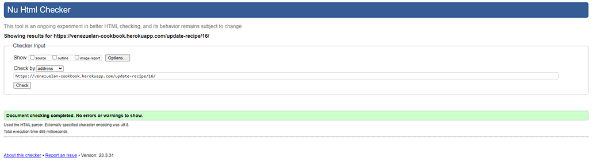
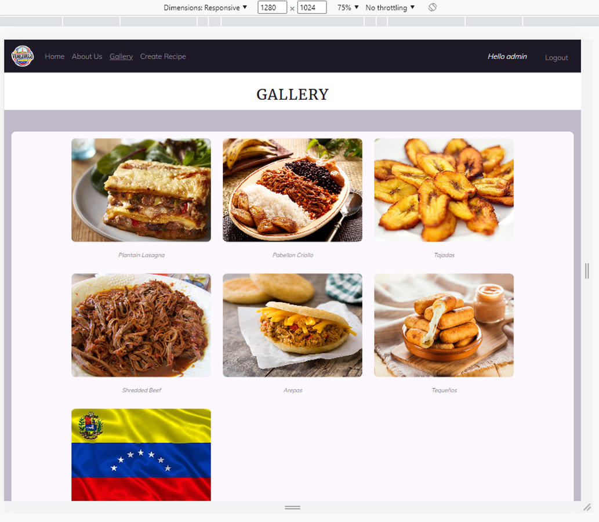
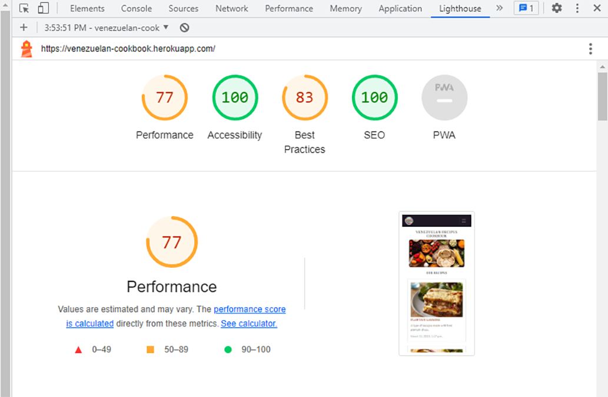
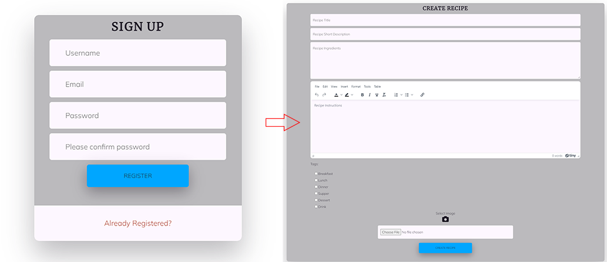

# Testing

Return back to the [README.md](README.md) file.

## Code Validation

In this section I ran validation for all the code I produced in the project. I found bugs in the code and fixed them, in order for it to work optimally and pass the tests.

### HTML

I have used the recommended [HTML W3C Validator](https://validator.w3.org) to validate all of my HTML files.

| Page | W3C URL | Before Screenshot | After Screenshot | Notes |
| --- | --- | --- | --- | --- |
| Register | [W3C](https://validator.w3.org/nu/?doc=https%3A%2F%2Fvenezuelan-cookbook.herokuapp.com%2Fregister%2F) |  |  | Bad value (empty) for action on element form, fixed |
| Login | [W3C](https://validator.w3.org/nu/?doc=https%3A%2F%2Fvenezuelan-cookbook.herokuapp.com%2Flogin%2F) |  |  | Passed no errors |
| Index/Home | [W3C](https://validator.w3.org/nu/?doc=https%3A%2F%2Fvenezuelan-cookbook.herokuapp.com%2F) |  |  | Duplicate ID errors, Stray end tag div error, all fixed |
| Recipe | [W3C](https://validator.w3.org/nu/?doc=https%3A%2F%2Fvenezuelan-cookbook.herokuapp.com%2Frecipe%2F16%2F) |  |  | Duplicate ID errors, Trailing slash warning, all fixed |
| Recipe/Logged-In | [W3C](https://validator.w3.org/nu/?doc=https%3A%2F%2Fvenezuelan-cookbook.herokuapp.com%2Frecipe%2F16%2F) |  |  | No p element in scope but a p end tag seen error, Bad value for attribute action error, The element button must not appear as a descendant of the a element errors, all fixed. This test had to be validated by input since pages that require a user to be logged-in and authenticated (CRUD functionality), will not work using uri validation method, due to the fact that the HTML Validator (W3C) doesn't have access to login to the pages. |
| About-Us | [W3C](https://validator.w3.org/nu/?doc=https%3A%2F%2Fvenezuelan-cookbook.herokuapp.com%2Fabout-us%2F) |  |  | Passed no errors |
| Gallery | [W3C](https://validator.w3.org/nu/?doc=https%3A%2F%2Fvenezuelan-cookbook.herokuapp.com%2Fgallery%2F) |  |  | Passed no errors |
| Create Recipe | [W3C](https://validator.w3.org/nu/?doc=https%3A%2F%2Fvenezuelan-cookbook.herokuapp.com%2Fcreate-recipe%2F) |  |  | Element p not allowed as a child of element label error, fixed |
| Update Recipe | [W3C](https://validator.w3.org/nu/?doc=https%3A%2F%2Fvenezuelan-cookbook.herokuapp.com%2Fupdate-recipe%2F16%2F) |  |  | Stray end tags form and divs errors, all fixed |
| Delete Recipe | [W3C](https://validator.w3.org/nu/?doc=https%3A%2F%2Fvenezuelan-cookbook.herokuapp.com%2Fdelete-recipe%2F16%2F) |  |  | Passed no errors |

### CSS

I have used the recommended [CSS Jigsaw Validator](https://jigsaw.w3.org/css-validator) to validate all of my CSS files.

| File | Jigsaw URL | Before Screenshot | After Screenshot | Notes |
| --- | --- | --- | --- | --- |
| style.css | [Jigsaw](https://jigsaw.w3.org/css-validator/validator?uri=https%3A%2F%2Fvenezuelan-cookbook.herokuapp.com%2F&profile=css3svg&usermedium=all&warning=1&vextwarning=&lang=en) |  |  | Parse errors, Unknown pseudo-element error, all fixed. The warnings shown are the result of using Cloudinary and Bootstrap |

### JavaScript

I have used the recommended [JShint Validator](https://jshint.com) to validate all of my JS files.

| File | Screenshot | Notes |
| --- | --- | --- |
| script.js |  | Passed no errors |

### Python

I have used the recommended [CI Python Linter](https://pep8ci.herokuapp.com) to validate all of my Python files.

| File | CI URL | Raw URL | Combined |
| --- | --- | --- | --- |
| Venezuelan Food *settings.py* | `https://pep8ci.herokuapp.com/` | `https://raw.githubusercontent.com/leonardo-simeone/venezuelan-food-cookbook/main/venezuelan_food/settings.py` | https://pep8ci.herokuapp.com/https://raw.githubusercontent.com/leonardo-simeone/venezuelan-food-cookbook/main/venezuelan_food/settings.py# |
| Cookbook *admin.py* | `https://pep8ci.herokuapp.com/` | `https://raw.githubusercontent.com/leonardo-simeone/venezuelan-food-cookbook/main/cookbook/admin.py` | https://pep8ci.herokuapp.com/https://raw.githubusercontent.com/leonardo-simeone/venezuelan-food-cookbook/main/cookbook/admin.py |
| Cookbook *urls.py* | `https://pep8ci.herokuapp.com/` | `https://raw.githubusercontent.com/leonardo-simeone/venezuelan-food-cookbook/main/cookbook/urls.py` | https://pep8ci.herokuapp.com/https://raw.githubusercontent.com/leonardo-simeone/venezuelan-food-cookbook/main/cookbook/urls.py |
| Cookbook *models.py* | `https://pep8ci.herokuapp.com/` | `https://raw.githubusercontent.com/leonardo-simeone/venezuelan-food-cookbook/main/cookbook/models.py` | https://pep8ci.herokuapp.com/https://raw.githubusercontent.com/leonardo-simeone/venezuelan-food-cookbook/main/cookbook/models.py |
| Cookbook *forms.py* | `https://pep8ci.herokuapp.com/` | `https://raw.githubusercontent.com/leonardo-simeone/venezuelan-food-cookbook/main/cookbook/forms.py` | https://pep8ci.herokuapp.com/https://raw.githubusercontent.com/leonardo-simeone/venezuelan-food-cookbook/main/cookbook/forms.py |
| Cookbook *views.py* | `https://pep8ci.herokuapp.com/` | `https://raw.githubusercontent.com/leonardo-simeone/venezuelan-food-cookbook/main/cookbook/views.py` | https://pep8ci.herokuapp.com/https://raw.githubusercontent.com/leonardo-simeone/venezuelan-food-cookbook/main/cookbook/views.py |
| Cookbook *test_urls.py* | `https://pep8ci.herokuapp.com/` | `https://raw.githubusercontent.com/leonardo-simeone/venezuelan-food-cookbook/main/cookbook/test_urls.py` | https://pep8ci.herokuapp.com/https://raw.githubusercontent.com/leonardo-simeone/venezuelan-food-cookbook/main/cookbook/test_urls.py |
| Cookbook *test_models.py* | `https://pep8ci.herokuapp.com/` | `https://raw.githubusercontent.com/leonardo-simeone/venezuelan-food-cookbook/main/cookbook/test_models.py` | https://pep8ci.herokuapp.com/https://raw.githubusercontent.com/leonardo-simeone/venezuelan-food-cookbook/main/cookbook/test_models.py |
| Cookbook *test_forms.py* | `https://pep8ci.herokuapp.com/` | `https://raw.githubusercontent.com/leonardo-simeone/venezuelan-food-cookbook/main/cookbook/test_forms.py` | https://pep8ci.herokuapp.com/https://raw.githubusercontent.com/leonardo-simeone/venezuelan-food-cookbook/main/cookbook/test_forms.py |
| Cookbook *test_views.py* | `https://pep8ci.herokuapp.com/` | `https://raw.githubusercontent.com/leonardo-simeone/venezuelan-food-cookbook/main/cookbook/test_views.py` | https://pep8ci.herokuapp.com/https://raw.githubusercontent.com/leonardo-simeone/venezuelan-food-cookbook/main/cookbook/test_views.py |

| File | CI URL | Before Screenshot | After Screenshot | Notes |
| --- | --- | --- | --- | --- |
| Venezuelan Food *settings.py* | [CI PEP8](https://pep8ci.herokuapp.com/https://raw.githubusercontent.com/leonardo-simeone/venezuelan-food-cookbook/main/venezuelan_food/settings.py#) |  |  | E501 line too long errors, all fixed |
| Cookbook *admin.py* | [CI PEP8](https://pep8ci.herokuapp.com/https://raw.githubusercontent.com/leonardo-simeone/venezuelan-food-cookbook/main/cookbook/admin.py) |  |  | Passed no errors |
| Cookbook *urls.py* | [CI PEP8](https://pep8ci.herokuapp.com/https://raw.githubusercontent.com/leonardo-simeone/venezuelan-food-cookbook/main/cookbook/urls.py) |  |  | Passed no errors |
| Cookbook *models.py* | [CI PEP8](https://pep8ci.herokuapp.com/https://raw.githubusercontent.com/leonardo-simeone/venezuelan-food-cookbook/main/cookbook/models.py) |  |  | E501 line too long errors, all fixed |
| Cookbook *forms.py* | [CI PEP8](https://pep8ci.herokuapp.com/https://raw.githubusercontent.com/leonardo-simeone/venezuelan-food-cookbook/main/cookbook/forms.py) |  |  | E501 line too long error, fixed |
| Cookbook *views.py* | [CI PEP8](https://pep8ci.herokuapp.com/https://raw.githubusercontent.com/leonardo-simeone/venezuelan-food-cookbook/main/cookbook/views.py) |  |  | E501 line too long errors, W293 blank line contains whitespace error, all fixed |
| Cookbook *test_urls.py* | [CI PEP8](https://pep8ci.herokuapp.com/https://raw.githubusercontent.com/leonardo-simeone/venezuelan-food-cookbook/main/cookbook/test_urls.py) |  |  | Passed no errors |
| Cookbook *test_models.py* | [CI PEP8](https://pep8ci.herokuapp.com/https://raw.githubusercontent.com/leonardo-simeone/venezuelan-food-cookbook/main/cookbook/test_models.py) |  |  | E501 line too long errors, all fixed |
| Cookbook *test_forms.py* | [CI PEP8](https://pep8ci.herokuapp.com/https://raw.githubusercontent.com/leonardo-simeone/venezuelan-food-cookbook/main/cookbook/test_forms.py) |  |  | E501 line too long errors, all fixed |
| Cookbook *test_views.py* | [CI PEP8](https://pep8ci.herokuapp.com/https://raw.githubusercontent.com/leonardo-simeone/venezuelan-food-cookbook/main/cookbook/test_views.py) |  |  | E501 line too long errors, all fixed |

## Browser Compatibility

I've tested my deployed project on multiple browsers to check for compatibility issues.

| Browser | Screenshot | Notes |
| --- | --- | --- |
| Chrome |  | Works as expected |
| Edge |  | Works as expected |
| Firefox |  | Works as expected |

## Responsiveness

I've tested my deployed project on multiple devices to check for responsiveness issues.

| Device | Screenshot | Notes |
| --- | --- | --- |
| Mobile (DevTools) |  | Works as expected |
| Tablet (DevTools) |  | Works as expected |
| Desktop (DevTools) |  | Works as expected |
| XL Monitor |  | Works as expected |
| 4K Monitor |  | Works as expected |
| Samsung Galaxy A52s (my own phone) |  | Works as expected |

## Lighthouse Audit

I've tested my deployed project using the Lighthouse Audit tool to check for any major issues.

| Page | Size | Screenshot | Notes |
| --- | --- | --- | --- |
| Home | Mobile |  | Few warnings |
| Home | Desktop |  | Some minor warnings |
| About Us | Mobile |  | Few warnings |
| About Us | Desktop |  | Some minor warnings |
| Gallery | Mobile |  | Slow response time due to amount of images, few warnings |
| Gallery | Desktop |  | Slow response time due to amount of images, some minor warnings |
| Recipe | Mobile |  | few warnings |
| Recipe | Desktop |  | some minor warnings |
| Create Recipe | Mobile |  | few warnings |
| Create Recipe | Desktop |  | some minor warnings |
| Update Recipe | Mobile |  | few warnings |
| Update Recipe | Desktop |  | some minor warnings |
| Delete Recipe | Mobile |  | some minor warnings |
| Delete Recipe | Desktop |  | some minor warnings |
| Register | Mobile |  | few warnings |
| Register | Desktop |  | some minor warnings |
| Login | Mobile |  | few warnings |
| Login | Desktop |  | some minor warnings |

## Defensive Programming

Defensive programming was manually tested with the below user acceptance testing:

| Page | User Action | Expected Result | Pass/Fail | Comments |
| --- | --- | --- | --- | --- |
| Home Page | | | | |
| | Click on Logo | Redirection to Home page | Pass | |
| | Click on Home link in navbar | Redirection to Home page | Pass | |
| About Us Page | | | | |
| | Click on About Us link in navbar | Redirection to About Us page | Pass | |
| | Click on About Us link in footer | Redirection to About Us page | Pass | |
| Gallery Page | | | | |
| | Click on Gallery link in navbar | Redirection to Gallery page | Pass | |
| | Click on Gallery link in footer | Redirection to Gallery page | Pass | |
| | Load gallery images | All images load as expected | Pass | |
| | Click gallery images | All images links redirect user to corresponding recipe page | Pass | |
| Create Recipe Page | | | | |
| | Click on Create Recipe link in navbar | Redirection to Create Recipe page | Pass | |
| | Click on Create Recipe button | New recipe will be created and user redirected to Home page | Pass | A message will show at the top of the page to indicate the user they've created the recipe successfully |
| | Click on Create Recipe button without requiered values for recipe | An error will show on the form to indicate the user what's missing | Pass | |
| | Brute forcing the URL to get to Create Recipe page without logging in first | User will be redirected to Login page | Pass | |
| Update Recipe Page | | | | |
| | Click on Edit Recipe button in Recipe page | Redirection to Update Recipe page | Pass | |
| | Click on Edit Recipe button | Existing recipe will be updated and user redirected to the updated recipe page | Pass | A message will show at the top of the page to indicate the user they've updated the recipe successfully |
| | Click on Edit Recipe button without requiered values for recipe | The screen will reposition and focus (css) in the field where data is missing | Pass | |
| | Brute forcing the URL to get to Update Recipe page without logging in first | User will be redirected to Login page | Pass | |
| | Brute forcing the URL to get to Update Recipe page of another user's recipe | An error will show at the top of the page to indicate the user that they don't have permission to update this recipe | Pass | |
| Delete Recipe Page | | | | |
| | Click on Delete Recipe button in Recipe page | Redirection to Delete Recipe page | Pass | Confirms deletion first |
| | Click on Delete Recipe button | Existing recipe will be deleted and user redirected to home page | Pass | A message will show at the top of the page to indicate the user they've deleted the recipe successfully |
| | Click on Go Back button | User is redirected to the current recipe page | Pass | |
| | Brute forcing the URL to get to Delete Recipe page without logging in first | User will be redirected to Login page | Pass | |
| | Brute forcing the URL to get to Delete Recipe page of another user's recipe | An error will show at the top of the page to indicate the user that they don't have permission to delete this recipe | Pass | |
| Register | | | | |
| | Click on Register link in navbar, carousel call to action or About Us page call to action | Redirection to Register page | Pass | |
| | Enter valid username | Field will accept free text format | Pass | |
| | Enter valid email address | Field will only accept email address format | Pass | |
| | Enter valid password (twice) | Field will only accept password format | Pass | |
| | Click on Register button | User is registered, logged in automatically and redirected Home | Pass | A message will show at the top of the page to indicate the user they've registered successfully |
| | Click on Register button without requiered values | An error will show on the form to indicate the user what's missing | Pass | |
| Log In | | | | |
| | Click on the Login link in navbar | Redirection to Login page | Pass | |
| | Enter valid email address | Field will only accept email address format | Pass | |
| | Enter valid password | Field will only accept password format | Pass | |
| | Click Login button | Redirects user to home page | Pass | A message will show at the top of the page to indicate the user they've logged in successfully |
| | Click Login button with wrong data | An error will show at the top of the page to indicate the user what's wrong | Pass | |
| Log Out | | | | |
| | Click Logout button | Logs out user and redirects user to home page | Pass | A message will show at the top of the page to indicate the user they've logged out successfully |

## User Story Testing

| User Story | Screenshot |
| --- | --- |
| As a site user, I would like to view a list of recipes, so that I can select one to read. |  |
| As a site user, I would like to click on a recipe, so that I can read/see the full content. |  |
| As a site user/site administrator, I would like to view comments on an individual recipe, so that I can read the conversation. |  |
| As a site user, I would like to register an account, so that I can create my own recipes. |  |
| As a site user, I would like to view a paginated list of recipes, so that I can easily select which recipe to view. |  |
| As a registered site user, I would like to  make comments on a recipe, so that I can start and/or be involved in a conversation. |  |
| As a registered site user, I would like to update and delete recipes, so that I can manage my recipes content. |  |
| As a registered site user, I would like to place tags on my created recipes, so that I can indicate the meal type. |  |
| As a registered site user, I would like to like recipes, so that I can show I liked a particular recipe. |  |
| As a registered site user, I would like to avail of a website with a UX based design, so that I can navigate and interact with it easily and intuitively. |  |
| As a site administrator, I should be able to create, read, update and delete my own recipes and the ones created by registered users, so that I can moderate the content of the site. |  |
| As a site administrator, I should be able to create, read, update and delete my comments and the ones created by registered users, so that I can moderate the conversations. |  |
| As a product owner, I would like to run automated tests, so that I can make sure everything is working as it should. |  |
